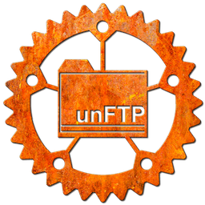

# unFTP

[](https://travis-ci.org/bolcom/unFTP)

When you need to FTP, but don't want to.



unFTP is a FTP(S) server written in [Rust](https://www.rust-lang.org) and built on top of [libunftp](https://github.com/bolcom/libunftp) and the [Tokio](https://tokio.rs) asynchronous run-time. It is **un**like your normal FTP server in that it provides:

- Configurable Authentication (e.g. Anonymous, [PAM](https://en.wikipedia.org/wiki/Linux_PAM) or a JSON file).
- Configurable storage back-ends (e.g. [GCS](https://cloud.google.com/storage/) or filesystem)
- Integration with [Prometheus](https://prometheus.io) for monitoring.

With unFTP, you can present RFC compliant FTP(S) to the outside world while freeing yourself to use modern APIs and 
techniques on the inside of your perimeter.

**unFTP is still in development and therefore not suitable for use in production yet.**

## Prerequisites

You'll need [Rust](https://rust-lang.org) 1.41 (including `cargo`) or higher to build unFTP.

Run `make help` to see an overview of the supplied *make* targets.

## Running

To run with default settings:

```sh
cargo run
```

To show a list of program arguments:

```sh
cargo run -- \
  --help
```

Example running an instance with a filesystem back-end and custom port

```sh
cargo run -- \
  --root-dir=/home/unftp/data \
  --bind-address=0.0.0.0:2121
```

With FTPS enabled:

```sh
# Generate keypair
openssl req \
   -x509 \
   -newkey rsa:2048 \
   -nodes \
   -keyout unftp.key \
   -out unftp.crt \
   -days 3650 \
   -subj '/CN=www.myunftp.domain/O=My Company Name LTD./C=NL'

# Run, pointing to cert and key
cargo run -- \
  --root-dir=/home/unftp/data \
  --ftps-certs-file=/home/unftp/unftp.crt \
  --ftps-key-file=/home/unftp/unftp.key
```

Enabling the [Prometheus](https://prometheus.io) exporter on (`http://../metrics`), binding to port 8080:

```sh
cargo run -- \
  --bind-address=0.0.0.0:2121 \
  --bind-address-http=0.0.0.0:8080 \
  --root-dir=/home/unftp/data
```

With the GCS back-end:

```sh
cargo run -- \
  --sbe-type=gcs \
  --sbe-gcs-bucket=mybucket \
  --sbe-gcs-key-file=file
```

## Docker image

The project contains templated Dockerfiles . To get a list of available commands, run:

```sh
make
```

We offer 3 different options for building an unFTP docker image:

- `scratch`
- `alpine` (default): build unftp in rust-slim and deploy in alpine. This image is built with musl instead of a full-blown libc.
- `alpine-debug`: build & run on the rust-slim base and adds some tools like libunftp

To build the alpine docker image:

```sh
make docker-image-alpine
```

## Features

unFTP offers optional features in its Cargo.toml:

- `pam`: enables the PAM authentication module
- `jsonfile_auth`: enables the JSON file authentication module
- `cloud_storage`: enables the Google Cloud Storage (GCS) storage backend

## License

You're free to use, modify and distribute this software under the terms of the Apache-2.0 license.

## See also

- [libunftp](https://github.com/bolcom/libunftp)
